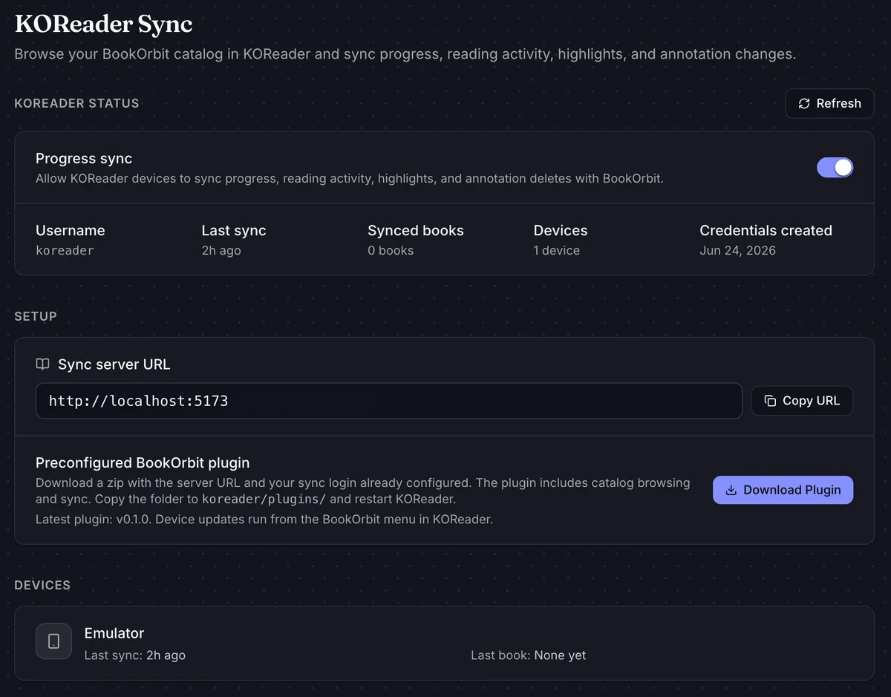

> **This is a personal fork of [CrossInk](https://github.com/uxjulia/CrossInk)** that adds [BookOrbit](https://github.com/bookorbit/bookorbit) integration — two-way sync of reading progress, highlights and bookmarks, and a catalog browser for downloading books straight from your own server — plus a working clock on hardware that has no clock chip.

Everything else — fonts, themes, reader features, reading stats, controls, the web server — comes from CrossInk unchanged, with one exception: KOReader Sync is removed to make room (see below). See the [upstream README](https://github.com/uxjulia/CrossInk#readme) for those, and the [docs](./docs/) folder in this repository for the detailed guides.

**Note**: this fork publishes releases for the Xteink X3 and X4 and the Seeed reTerminal Sticky.

---

## What's different in this fork

- **BookOrbit progress sync** — sync your reading position with a self-hosted BookOrbit server.
- **BookOrbit highlight and bookmark sync** — two-way: what you highlight or bookmark on the device appears in the web reader at its exact place in the text, what you add on the web lands in the book, and deletions propagate both ways.
- **BookOrbit catalog browser** — browse your server's library on the device and download EPUBs over WiFi, including by author and by series.
- **Offline shortcuts to your own books** — "On device" and "In progress" categories that open a book directly, without touching the network.
- **Reading statistics pushed to BookOrbit** — your reading time, streaks and pace on the server's dashboard, fed by the pages you turn on the device.
- **A working clock on the X4** — the status-bar clock, which upstream can only show on hardware that has a clock chip, plus an opt-in mode that keeps the time running through sleep.
- **KOReader Sync is removed** — its screens, settings and shortcut are gone. The X3/X4 firmware gets a 6.5 MB partition, and this fork's BookOrbit layer plus CrossInk's own growth stopped fitting in it; dropping the second sync provider is what buys the room. Credentials already saved on the SD card are left alone, simply unread.

BookOrbit exposes a KOReader-compatible sync API, so this fork talks to it the same way the official BookOrbit KOReader plugin does. Your BookOrbit server must be recent enough to serve the KOReader plugin endpoints under `{server}/api/v1/koreader` — including `plugin/catalog/*` for the catalog browser and `plugin/annotations/*` / `plugin/bookmarks/*` for highlight and bookmark sync (servers without those are detected, and the missing steps are simply skipped).

---

## Setting up your BookOrbit account

### On your BookOrbit server

The device signs in with your account's **KOReader sync credentials**, not your BookOrbit web login. Create them once, in **Settings → Devices & Sync → KOReader**, with **Create credentials** — each BookOrbit account has a single set, shared by all of its readers. Once they exist, the page's **Setup** panel shows the **Sync server URL**:



That URL is what the device asks for below. The preconfigured plugin offered on the same page is for actual KOReader devices — CrossInk needs only the URL and the credentials.

### On the device

1. Go to **Settings → System → BookOrbit Sync**.
2. Fill in **Username** and **Password** — the KOReader sync credentials created above — and **Server URL**, the Sync server URL shown on the same page. The URL accepts a bare hostname (`books.example.com`); `https://` is assumed, and a pasted `/api/v1` or `/api/v1/koreader` suffix is stripped for you.
3. Choose **Authenticate**. The device connects to WiFi and validates the credentials against your server. You should see _Successfully authenticated!_

Credentials live on the SD card in `/.crosspoint/bookorbit.json`, obfuscated with the device's hardware MAC — the same scheme CrossInk uses for KOReader credentials.

## Syncing reading progress

Open a book, then **Menu → Bookmarks tab → BookOrbit Sync**. The device compares the position stored on the server with your local one — chapter, page, percentage and the device name that last uploaded — and offers two choices:

- **Apply remote progress** — jump to the position from your other reader.
- **Upload local progress** — publish your current position to the server.

The option matching the furthest-read position is preselected. If the server has no progress for the book yet, you are offered a straight upload.

### Smart sync

**Settings → System → BookOrbit Sync → Sync Behavior** chooses what a sync does with that screen. **Ask every time**, the default, always shows it. **Smart sync** resolves the clear cases on its own and only asks when asking is genuinely useful:

- If the server is further ahead _and_ has been updated since this device last synced the book, the server position is applied and you are back in the book.
- If your local position is further ahead _and_ the server has not moved since this device last synced, your position is uploaded — the screen flashes "Upload successful" and returns on its own.
- Equal positions just say "Already synced" and return.

Anything else still shows the choice screen: the first sync of a book on a device, a server that reports no dates, and above all a genuine conflict — both sides having moved since your last sync, which is exactly the case a human should arbitrate. Each device remembers its last sync of each book in a small file next to the book's cache, and every sync updates it whichever mode is active, so the history smart sync relies on is already in place when you enable it.

BookOrbit identifies books by the binary partial-MD5 hash of the EPUB file (the same "Binary" matching KOReader offers), so the **same EPUB file** has to be present on both readers for positions to pair up. A book downloaded from your BookOrbit catalog is the exact file your server knows about, so it matches automatically.

### Syncing without opening the menu

**Settings → Controls** lets you bind _BookOrbit Sync_ to the power button (short or long press) or to a long press on Menu or Back. The action also works outside the reader: it syncs the book you last had open, or opens the BookOrbit settings if no account is configured yet.

## Syncing highlights and bookmarks

Every BookOrbit sync of a book also exchanges its highlights and bookmarks with the
server, in both directions:

- **Highlights** made on the device appear in BookOrbit's web reader at their exact
  position in the text, with the book's exact wording; highlights created in the web
  reader come down and are drawn in the book. Deleting one on either side removes it
  from the other at the next sync.
- **Bookmarks** work the same way: a page bookmarked on the device shows up in the web
  reader, and a bookmark placed on the web lands in the book — on the right page when
  the device has already read that chapter, at the chapter start otherwise, refined the
  first time you jump to it.

Nothing to enable: if an account is configured, both ride along with every sync, and
the sync screen reports what each exchange did ("Highlights: 2 sent, 1 added, 0
removed"). Book matching is the same binary hash as progress sync, so the same EPUB
file has to be on both sides.

Details worth knowing:

- New highlights upload in batches of 8 per sync — this hardware bounds what fits
  beside an open TLS connection — so a large backlog drains over a few syncs.
- Highlights and bookmarks made before this feature existed gain their sync identity
  progressively as you read, one chapter per visit, and start syncing from there.
- A highlight's stored text is capped at 2 KB; an extremely long web highlight is drawn
  up to where that cap cuts its text.

## Reading statistics

Every BookOrbit sync of a book also uploads the reading it has recorded since the last
one: one event per page you read, with when you started it and how long you stayed on it.
That is what the official BookOrbit KOReader plugin sends too, so the server's reading
time, streaks, pace and reading-DNA views fill in the same way. It is one-way — BookOrbit
has no API to read stats back — so the device's own Reading Stats screens are unaffected
and keep working offline.

Nothing to enable: if an account is configured, the events ride along with each sync. They
are queued per book on the SD card in the meantime, so nothing is lost if you read offline
for a week.

### How faithful the timestamps are

**On the X3 this section does not apply**: it has a clock chip, so every page event is
stamped with the real time and lands exactly where it belongs.

The X4 has no clock chip. Its clock stops whenever the device sleeps, and the firmware can
only put it back to the last time it knew about at wake — so a page read at 20:00 can be
recorded as if it happened at 08:20. Rather than upload that, the device records which
_clock timeline_ each event belongs to and fixes the timestamps at upload time, using the
error each sync measures against NTP. Two cases:

- **With Settings → System → Device → Keep Clock While Asleep on**, the clock never stops,
  so the only error is the oscillator's drift — a couple of minutes per 12 h. Each sync
  measures that drift and spreads it across the events in proportion to when they
  happened, so sessions land within seconds of reality. Nothing to think about. Note that
  the drift is only corrected in the _uploaded stats_: the clock **shown** on screen stays
  a minute or two off until the next WiFi connection resets it.
- **With the option off**, accuracy depends on you syncing at least once per run — a run
  being everything between two sleeps. A sync anchors the run's whole timeline, so every
  session it uploads is placed correctly, including the ones read before it in that run.

The friction points of leaving the option off:

- **A run with no sync in it keeps a wrong timestamp for good.** Its sessions are dated
  from the last time the device knew, which is where the _previous_ run ended — so they
  pile up right after it. Read in the morning, sleep, read in the evening and sync only
  then, and the morning session is the one that lands wrong, possibly on the previous day.
  That is a real cost on the server side: BookOrbit's streaks and daily charts key off the
  date, so a misdated session breaks a streak that you did not actually break.
- **The order and the pacing are always right, only the anchor moves.** Gaps between pages
  within a run are measured by a timer that keeps running, so a shifted block stays
  internally exact — a session never appears to last longer or shorter than it did.
- **It gets worse with each sleep, not with time.** Three runs without a sync means three
  blocks stacked onto the same anchor, not a gradual smear.
- **The cheap mitigation is a button.** Bind _BookOrbit Sync_ to the power button under
  **Settings → Controls** and press it when you put the book down; one sync per run is all
  the accuracy needs. It is also what drains the queue, so it costs nothing extra.
- **A flat battery or a firmware flash loses the clock entirely.** The sessions queued
  before that still upload correctly as long as a sync happens in the same run, because
  they are placed relative to that sync rather than by absolute time.

## Browsing and downloading from the catalog

Reach the catalog from **Settings → System → BookOrbit Sync → Browse Catalog**, or from the **BookOrbit** entry in the home menu (it appears once an account is configured).

The root list contains:

| Entry                                         | What it shows                                                                                          |
| --------------------------------------------- | ------------------------------------------------------------------------------------------------------ |
| Recently added / Continue reading / All books | Your server's own sections                                                                             |
| **Authors** / **Series**                      | Paged lists with a book count per entry; pick one to see its books (series are listed in series order) |
| **Search**                                    | Free-text search of your library                                                                       |
| **On device**                                 | Every EPUB already in the SD card root and the `/Read` folder — works offline                          |
| **In progress**                               | Recent books you haven't finished yet — works offline                                                  |

In a server book list, **Confirm** downloads the book to the SD card root as `Title - Author.epub`. A download that gets interrupted resumes automatically on retry, and **Back** cancels it. Books already present on the device are marked with a dot at the end of the line, so you can tell at a glance what is worth downloading.

In **On device** and **In progress**, Confirm opens the book in the reader instead of downloading it.

> If the catalog reports _"BookOrbit sent an unexpected reply"_, the server answered but not with the catalog API — usually a BookOrbit version without the KOReader catalog endpoints, a wrong server URL, or a reverse proxy/SSO layer intercepting `/api/v1/koreader/plugin/*`.

---

## Clock on devices without a clock chip

The X4 has no battery-backed RTC, so upstream's status-bar clock never appeared on it and
its settings were hidden. Here the clock reads the device's system clock instead, which is
refreshed from NTP on every WiFi connection.

To turn it on, set **Settings → Display → Hide Clock** to `Never` (or `In reader` if you
would rather not see it while reading), then set **Settings → System → Device → Clock UTC
Offset** and **Clock Format**. The time appears once the device has been connected to WiFi at least
once — before that there is nothing to display.

### Keeping the time through sleep, and what it costs

By default the device releases its own power latch when it sleeps, which cuts power to
everything including the timer that counts wall-clock time. The time is therefore lost at
every sleep and only comes back at the next WiFi connection. **Settings → System → Device
→ Keep Clock While Asleep** skips that release, so the board stays powered, the processor
enters a genuine deep sleep, and the clock keeps running.

It is off by default because it trades standby battery life for an almost always-correct clock (time will drift when device is not connected to WiFi for a long time).
Before leaving it on, know that:

- **the device no longer powers off completely when it sleeps.** It keeps drawing a small
  current, so it will slowly discharge in a drawer instead of sitting indefinitely.
- **the cost has only been spot-checked.** On an X4, twelve hours of sleep with the setting
  enabled cost about 5% of battery, which extrapolates to roughly ten days of standby.
  Over the same twelve hours the clock drifted two to three minutes, since it runs on an
  internal RC oscillator rather than a crystal; the next WiFi connection resets it. Treat
  both as one measurement rather than a specification, and watch your own battery over a
  few days before relying on it.

Turning the setting back off restores the stock behaviour exactly.

It also decides how faithful your uploaded reading-session timestamps are — see
[Reading statistics](#reading-statistics), which is the main reason to leave it on.

---

## Installation

Download the `firmware-*.bin` for your device from **this repository's** [releases page](https://github.com/agosez/CrossInk-Bookorbit/releases) — not upstream's, which does not include BookOrbit support. CrossInk's own web installer only offers upstream builds, so flash the file as a custom firmware with the [CrossPoint flash tools](https://crosspointreader.com/#flash-tools), from the command line, or from the SD card — [Installation](./docs/installation.md) walks through each path, including USB-locked devices and reverting to upstream CrossInk.

Once this firmware is installed, **Settings → System → Check for Updates** resolves against this fork's releases, so later versions arrive over the air. Devices running upstream CrossInk will not see these releases: the first install has to be done by USB or SD card.

## Development

```sh
pio run -e default --target upload   # X3/X4 build, flashed over USB-C; see platformio.ini for the other devices
```

See [Getting Started](./docs/development/getting-started.md) for prerequisites and validation commands, and [Testing and Debugging](./docs/development/testing-debugging.md) for serial logging and static analysis. `AGENTS.md` holds the repository's engineering conventions.

## Documentation

- [User Guide](./docs/user-guide.md) and [Reader Features](./docs/reader-features.md)
- [Controls](./docs/controls.md) — full button action list
- [Installation](./docs/installation.md)
- [Data Cache](./docs/data-cache.md) and [File Formats](./docs/file-formats.md)
- [Common issues](./docs/troubleshooting.md)
